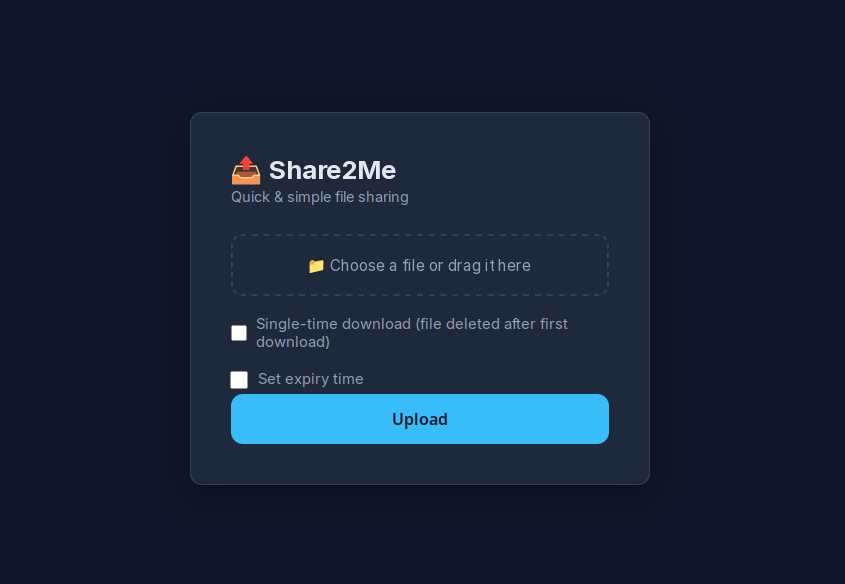

# Share2Me



Share2Me is a self-hosted file sharing server you run on your own machine or server. Once it's running, you get a private link for every file you upload — no accounts, no cloud service, no file size limits beyond your own disk space.

Everything runs over HTTPS. A TLS certificate is generated automatically on the first launch, so you can get going with zero configuration.

## What you can do with it

- **Upload from the browser** — open the web UI, pick a file, and get a shareable link instantly.
- **Upload from the terminal** — use `curl` to push files directly and get the link back in one command.
- **Single-use links** — mark a file as "single download" and it's permanently deleted the moment someone downloads it.
- **Expiring links** — set a time limit on any upload (e.g. 5 minutes, 2 hours, 3 days). The file disappears automatically once the time is up.
- **End-to-end encryption** — tick one checkbox to encrypt files in the browser before they leave your machine. The server only ever sees ciphertext; the key never travels over the network.
- **Your own domain with a real certificate** — point Share2Me at your domain and let it get a free Let's Encrypt certificate automatically.
- **HTTP → HTTPS redirect** — anyone who visits the plain HTTP address is silently redirected to HTTPS.

## Getting a pre-built binary

Every release has a ready-to-run Linux binary attached — no compiler needed. Go to the [Releases page](../../releases/latest), download `share2me-<version>-linux-x86_64`, make it executable, and run it:

```bash
chmod +x share2me-v1.0.0-linux-x86_64
./share2me-v1.0.0-linux-x86_64
```

The binary is statically linked and has no runtime dependencies.

## Building from source

You need CMake (≥ 3.20) and a C++20 compiler. Everything else is downloaded automatically during the build.

```bash
cmake -B build -DCMAKE_BUILD_TYPE=Release
cmake --build build -j$(nproc)
```

The result is a single binary at `build/share2me`. Copy it anywhere you like.

> **Let's Encrypt support** is compiled in automatically if `libcurl` is available at build time. The final binary has no dependency on `libcurl` — it's only needed on the machine where you compile. Without it the server works fine with a self-signed or manually supplied certificate.

## Releases & CI

GitHub Actions will build, strip, and attach the binary to the release automatically. Release notes are generated from the commits since the previous tag.

[Releases page](https://github.com/polaco1782/share2me/releases)

## Running

```bash
# Quickstart — HTTPS on port 8443, self-signed certificate, ready immediately
./build/share2me

# Use standard ports (requires root or CAP_NET_BIND_SERVICE)
./build/share2me --port 443 --http-port 80

# Use a certificate you already have
./build/share2me --domain example.com --cert /etc/ssl/example.crt --key /etc/ssl/example.key

# Get a free Let's Encrypt certificate automatically (port 80 must be reachable from the internet)
./build/share2me --domain example.com --email you@example.com --acme

# Test Let's Encrypt integration without burning your rate limit
./build/share2me --domain example.com --email you@example.com --acme --staging

# Turn off the HTTP redirect entirely
./build/share2me --http-port 0
```

Then open `https://localhost:8443` in your browser.

### All options

| Flag | Default | What it does |
|------|---------|--------------|
| `--port PORT` | `8443` | HTTPS port to listen on |
| `--http-port PORT` | `8080` | HTTP port used for redirects and Let's Encrypt challenges (`0` = off) |
| `--cert FILE` | `cert.pem` | Path to your TLS certificate |
| `--key FILE` | `key.pem` | Path to your TLS private key |
| `--domain NAME` | `localhost` | Your hostname (used in the certificate and in generated links) |
| `--acme` | off | Obtain a certificate from Let's Encrypt automatically |
| `--email EMAIL` | — | Your email address (required when using `--acme`) |
| `--staging` | off | Use Let's Encrypt's test environment (certificate won't be trusted by browsers) |
| `--sandbox` | off | Lock the process inside a chroot jail (requires root) |
| `--user NAME` | — | Drop privileges to this system user after startup (requires root) |

## Uploading files

### From the browser

1. Open `https://<host>:<port>` in your browser.
2. Pick a file.
3. Optionally turn on **Single-time download** or set an **expiry time**.
4. Optionally tick **End-to-end encrypted 🔒 E2EE** to encrypt the file in your browser before uploading (see below).
5. Click **Upload** and copy the link.

### From the terminal

```bash
# Upload a file and print the share link
curl -kT photo.jpg https://localhost:8443/photo.jpg

# Single-use link — file is gone after the first download
curl -kT report.pdf "https://localhost:8443/report.pdf?single"

# Link that expires in 2 hours
curl -kT notes.txt "https://localhost:8443/notes.txt?expire=2h"

# Both — single-use and expiring in 1 day
curl -kT archive.zip "https://localhost:8443/archive.zip?single&expire=1d"

# Save the link to a variable
url=$(curl -skT video.mp4 https://localhost:8443/video.mp4)
echo "Share this: $url"
```

Expiry values use a number followed by a unit: `m` (minutes), `h` (hours), `d` (days), `y` (years).

Drop the `-k` flag if you're using a trusted certificate (Let's Encrypt or your own CA).

## The share link

Every upload gets a unique, short link — for example `https://yourhost:8443/a1b2c3d4e5`. Anyone with the link can download the file. There are no passwords and no accounts. Keep the link private if you want the file to stay private.

## End-to-end encryption (E2EE)

When the **End-to-end encrypted** checkbox is ticked on the upload form, the file is encrypted entirely inside your browser using the Web Crypto API before a single byte is sent to the server.

### How it works

**Upload**

1. The browser generates a fresh 256-bit AES-GCM key using `crypto.subtle.generateKey`.
2. The file is split into 1 MB chunks. Each chunk is encrypted with its own random 12-byte IV:
   ```
   [4-byte chunk length (big-endian)] [12-byte IV] [ciphertext]
   ```
3. The resulting encrypted blob is uploaded to the server via the normal `POST /upload` path. The server stores opaque ciphertext — it has no access to the key or the plaintext.
4. The raw key is base64-encoded and embedded in the **URL fragment** together with the original filename:
   ```
   https://yourhost/d/a1b2c3d4e5#k=<base64-key>&n=photo.jpg
   ```

**Why the fragment?** The `#fragment` part of a URL is a browser-only concept. It is never included in the HTTP request sent to the server, so the key is mathematically impossible for the server to observe.

**Download**

1. The recipient opens the share link. The browser fetches the ciphertext from `/a1b2c3d4e5` (server sees a normal token request).
2. The key is read from `location.hash` — this happens entirely in JavaScript, never on the server.
3. Each frame is decrypted in order with `crypto.subtle.decrypt`.
4. The assembled plaintext is offered to the recipient as a browser download, named with the original filename stored in the fragment.

### What the server stores

| File data | AES-GCM ciphertext (opaque bytes) |
| Metadata | Token, ciphertext SHA-256, original filename, single-dl/expiry flags, `encrypted: true` |
| Encryption key | **Never stored — exists only in the share URL** |

### Compatibility with other features

- **`curl` / CLI uploads** — E2EE is a browser-only feature. `curl -T` uploads are always plaintext.

### Security properties

- The server operator cannot read encrypted files, even with full disk access.
- Revocation is still possible: delete the token from `data/` and the ciphertext is gone, making the key in the URL useless.
- Losing the share URL means losing the key — there is no recovery path.

## Privacy & security

**Nobody can browse your files.** There is no file listing, no index page, and no way to discover what has been uploaded. The only way to reach a file is to know its exact link.

Each link contains a randomly generated token (e.g. `a1b2c3d4e5`). There are over a trillion possible tokens, so guessing one is not a realistic attack. If you keep the link to yourself, the file is effectively private.

A few additional layers back this up:

- **HTTPS only** — all traffic is encrypted. The plain-HTTP server exists solely to redirect browsers to HTTPS; it never serves files.
- **End-to-end encryption** — when E2EE is enabled at upload time, the server only ever stores ciphertext. The key lives solely in the share URL fragment and never touches the server.
- **No enumeration** — every request that doesn't match a valid, known token gets a `403 Forbidden` response. There is no way to probe the server to find out what files exist.
- **Integrity verification** — a SHA-256 checksum is stored at upload time and re-checked on every download. If a file is tampered with on disk, the download is refused.
- **Self-destructing links** — single-use links delete the file the instant it is downloaded. Expiring links are removed automatically once their time is up, even if nobody ever downloads them.
- **Optional sandbox** — when started with `--sandbox`, the process is locked inside a chroot jail and (with `--user`) drops to a low-privilege system account, so a hypothetical server compromise cannot reach the rest of the filesystem.

The short version: share the link only with the people you trust, and the file is only accessible to them.

## TLS certificates

On the very first run, if no certificate files are found, Share2Me generates a self-signed certificate automatically. It covers the configured domain, `localhost`, and `127.0.0.1`, and is valid for 10 years. You'll get a browser warning the first time because the certificate is self-signed — that's expected. You can dismiss it or, for a trusted certificate, use Let's Encrypt via `--acme`.

To swap the certificate at any time, just delete `cert.pem` and `key.pem` and restart — a new one will be generated — or point `--cert` and `--key` at your own files.

## File storage

All uploaded files are kept in a `data/` directory next to the binary. Each file gets its own metadata record that tracks the original filename, a SHA-256 checksum, and any expiry or single-download settings. The checksum is verified on every download to ensure the file hasn't been corrupted. Expired files are cleaned up automatically in the background.

## License

Share2Me is released under the [MIT License](LICENSE).
