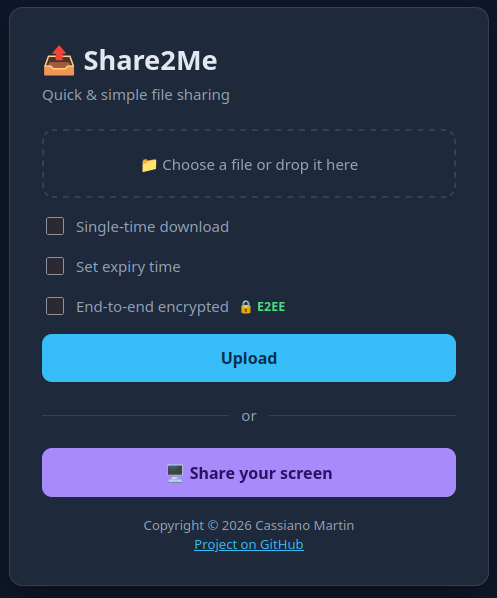

# Share2Me



Share2Me is a small self-hosted file-sharing server. It serves a browser UI and a curl-friendly API over HTTPS, with no accounts or file listing.

The server is implemented in safe Rust. The crate forbids application `unsafe` code, bounds every request body, streams uploads and downloads, and uses Rustls for TLS.

## Why Share2Me moved to Rust

Share2Me was originally implemented in C++. Because the server accepts untrusted uploads and is intended to face the public internet, it was ported to Rust to reduce its exposure to memory-safety vulnerabilities such as buffer overflows, use-after-free errors, and invalid memory access. Rust's ownership and type systems prevent these broad bug classes in the application code while retaining native performance.

Rust is not a substitute for security controls, so the port also validates untrusted input, limits resource use, streams large bodies, verifies stored content, applies restrictive browser headers, and supports privilege dropping and chroot isolation.

## Features

- Browser and command-line uploads, up to 512 MiB per file.
- Random, non-enumerable share links.
- Single-download links that remove their content when claimed.
- Expiring links with automatic background cleanup.
- Browser-side AES-256-GCM end-to-end encryption; keys stay in URL fragments and never reach the server.
- Safe text and image viewers. JavaScript and XML are not rendered inline for plaintext uploads.
- Automatic self-signed certificates or Let's Encrypt HTTP-01 provisioning and renewal.
- HTTP-to-HTTPS redirects.
- Optional chroot and permanent privilege dropping on Linux.

## Getting a release binary

Releases contain a statically linked Linux x86-64 binary:

```bash
chmod +x share2me-v1.0.0-linux-x86_64
./share2me-v1.0.0-linux-x86_64
```

See the [latest release](../../releases/latest).

## Building from source

Install Rust 1.88 or newer. For a normal build on the current machine, run:

```bash
cargo build --release --locked
```

The executable is `target/release/share2me`. This native build can depend on the build machine's glibc and should not be copied to an older Linux distribution.

For a portable, fully static Linux x86-64 binary, install the musl target and native compiler prerequisites:

```bash
rustup target add x86_64-unknown-linux-musl

# Fedora
sudo dnf install clang musl-devel musl-libc-static

# Debian/Ubuntu
sudo apt-get install musl-tools
```

Then use the repository build script:

```bash
./scripts/build-static.sh
```

The static executable is `target/x86_64-unknown-linux-musl/release/share2me`. The script selects the appropriate musl C compiler for Fedora or Debian-based systems and rejects an output that still contains a dynamic ELF interpreter or shared-library dependency. The checked-in `Cargo.lock` keeps application builds reproducible.

Run the full local validation suite with:

```bash
cargo fmt --all -- --check
cargo test --all-targets --locked
cargo clippy --all-targets --locked -- -D warnings
```

## Running

```bash
# HTTPS on 8443, HTTP redirect on 8080, automatic self-signed certificate
./target/release/share2me

# Standard public ports; root or CAP_NET_BIND_SERVICE is required to bind them
./target/release/share2me --port 443 --http-port 80

# Existing certificate and private key
./target/release/share2me \
  --domain example.com \
  --cert /etc/ssl/example.crt \
  --key /etc/ssl/example.key

# Let's Encrypt; the configured HTTP port must be publicly reachable as port 80
./target/release/share2me \
  --port 443 --http-port 80 \
  --domain example.com \
  --email you@example.com \
  --acme

# Test the ACME flow without using production rate limits
./target/release/share2me \
  --domain example.com \
  --email you@example.com \
  --acme --staging

# Disable the plain-HTTP listener
./target/release/share2me --http-port 0
```

Then open `https://localhost:8443`. A new self-signed certificate causes an expected browser warning.

### Options

| Flag | Default | Purpose |
|---|---:|---|
| `--port PORT` | `8443` | HTTPS listener port, 1-65535 |
| `--http-port PORT` | `8080` | Redirect and ACME HTTP-01 port; `0` disables it |
| `--cert FILE` | `cert.pem` | TLS certificate chain |
| `--key FILE` | `key.pem` | TLS private key |
| `--domain NAME` | `localhost` | Valid ASCII hostname or IP used in certificates and generated links |
| `--data-dir DIR` | `data` | Private file and metadata directory |
| `--acme` | off | Obtain and renew a Let's Encrypt certificate |
| `--email EMAIL` | — | ACME contact; required with `--acme` |
| `--staging` | off | Use Let's Encrypt staging |
| `--acme-verbose` | off | Log ACME challenge progress |
| `--sandbox` | off | Chroot into the data directory after startup; requires root and `--user` |
| `--user NAME` | — | Permanently drop to an unprivileged system account; requires root |
| `--http-log` | off | Log request method, path, status, and elapsed time |

### Endpoints

| Request | Purpose |
|---|---|
| `GET /` | Browser upload UI |
| `GET /healthz` | Returns `200 OK` |
| `POST /upload` | Multipart browser upload |
| `PUT /<filename>` | Raw command-line upload |
| `GET /<token>` | Download a stored file |
| `GET /v/<token>` | Safe text or image viewer |
| `GET /d/<token>` | Browser-side E2EE download page |

Unknown and malformed tokens return the same `404 Not Found` response.

## Uploading from the terminal

```bash
# Upload and print the share link
curl -kT photo.jpg https://localhost:8443/photo.jpg

# Single-use link
curl -kT report.pdf 'https://localhost:8443/report.pdf?single'

# Expire in two hours
curl -kT notes.txt 'https://localhost:8443/notes.txt?expire=2h'

# Combine both properties
curl -kT archive.zip 'https://localhost:8443/archive.zip?single&expire=1d'
```

Expiry values are a positive integer followed by `m`, `h`, `d`, or `y`, and are capped at 100 years. Omit `-k` when using a certificate trusted by the client.

## End-to-end encryption

The browser UI can encrypt a file before uploading it:

1. The browser creates a fresh 256-bit AES-GCM key.
2. It encrypts 1 MiB chunks with random 96-bit IVs and authenticates the format header plus each chunk's index.
3. The server stores only framed ciphertext and its SHA-256 digest.
4. The key and original filename are placed after `#` in the share URL.

URL fragments are not part of HTTP requests, so Share2Me never receives the key. Decryption and viewer rendering happen in the recipient's browser; the authenticated header also detects reordered, duplicated, or truncated chunks. Losing the complete URL means the file cannot be recovered.

## Storage and integrity

The data directory contains an opaque token file and a matching `<token>.json` record. Original filenames are metadata only and are never used as storage paths.

Uploads are streamed into owner-only temporary files, hashed as they arrive, synchronized, and atomically committed. Downloads derive their storage path from the validated token, open the file without following symlinks, verify SHA-256 on that same file descriptor, rewind it, and stream it to the client.

The background housekeeper removes expired records once per minute. Expired links are also removed synchronously when accessed.

## Security model

- Application code is safe Rust; `unsafe_code = "forbid"` is enforced by Cargo lints.
- The data directory and all stored data are owner-only (`0700`/`0600`).
- Rustls accepts modern TLS 1.2/1.3 suites and has a 10-second handshake timeout.
- Request bodies are hard-limited, uploads have a 30-second idle-body timeout, and only eight uploads write concurrently.
- Random tokens come from the operating system-backed Rust RNG and contain 128 bits of entropy.
- HTTP/1 headers have a 10-second read timeout, HTTP/2 stream/header counts are bounded, and the process is capped at 4096 descriptors.
- Uploaded names, metadata paths, response headers, origins, redirects, and HTML/JavaScript interpolation are validated or encoded.
- HTML uses per-response Content Security Policy nonces, `nosniff`, `no-referrer`, framing protection, and restrictive browser permissions.
- Single-use links are claimed in process before their open file is unlinked, preventing concurrent double consumption.
- Core dumps are disabled at startup so process memory cannot be written to crash files.
- ACME account keys and TLS private-key copies are stored with mode `0600`; temporary in-memory copies are zeroized.

Share links are bearer secrets. Anyone who has a complete link can retrieve the file, so transmit links only through a trusted channel.

### Sandbox deployment

For defense in depth, create a dedicated unprivileged account and run:

```bash
sudo ./target/release/share2me \
  --port 443 --http-port 80 \
  --data-dir /var/lib/share2me \
  --sandbox --user share2me
```

Share2Me binds both sockets and loads/provisions TLS before chrooting and dropping UID/GID. The drop is verified and supplementary groups are cleared. Certificate renewal is disabled inside the chroot because the certificate paths are outside it; renew externally and restart in that mode.

## Certificates

Without `--acme`, a missing or near-expiry certificate is replaced with an ECDSA self-signed certificate valid for ten years. It covers the configured domain, `localhost`, and `127.0.0.1`.

With `--acme`, account credentials are persisted under `acme_work/`, HTTP-01 challenges are served by the plain-HTTP listener, and the certificate is renewed when near expiry. The live Rustls configuration is reloaded for new connections. If ACME fails during provisioning, Share2Me logs the failure and falls back to a self-signed certificate.

## License

Share2Me is released under the [MIT License](LICENSE).
